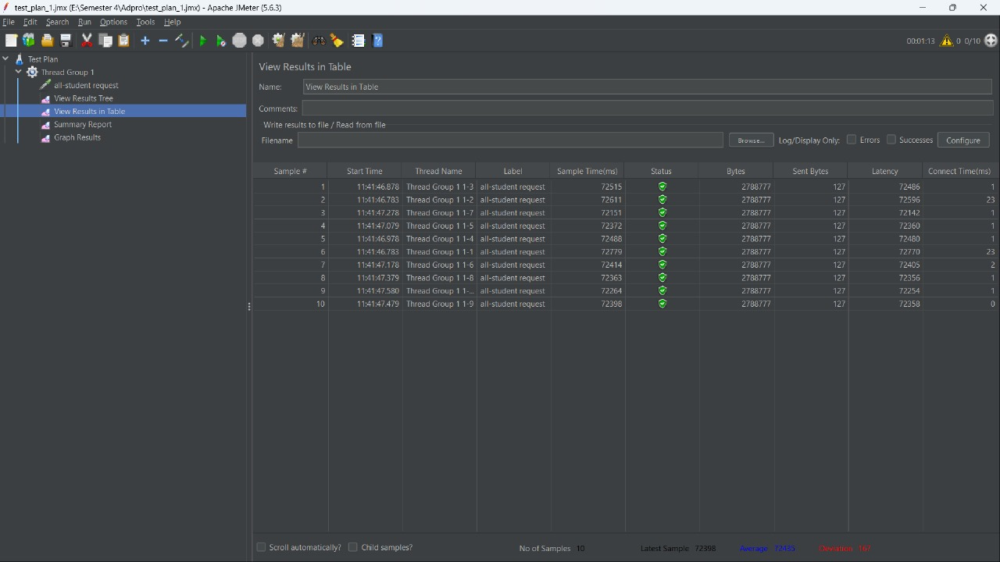
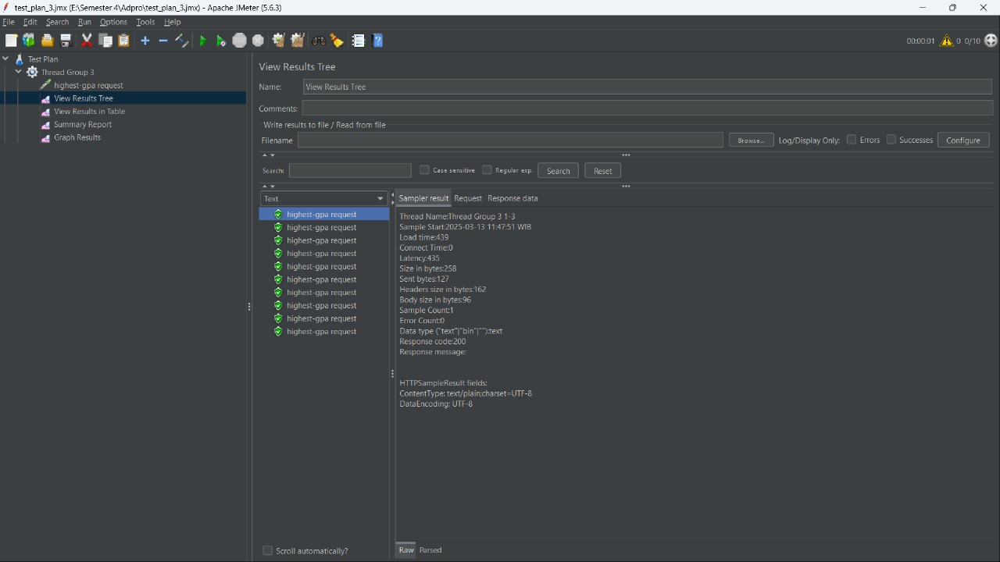
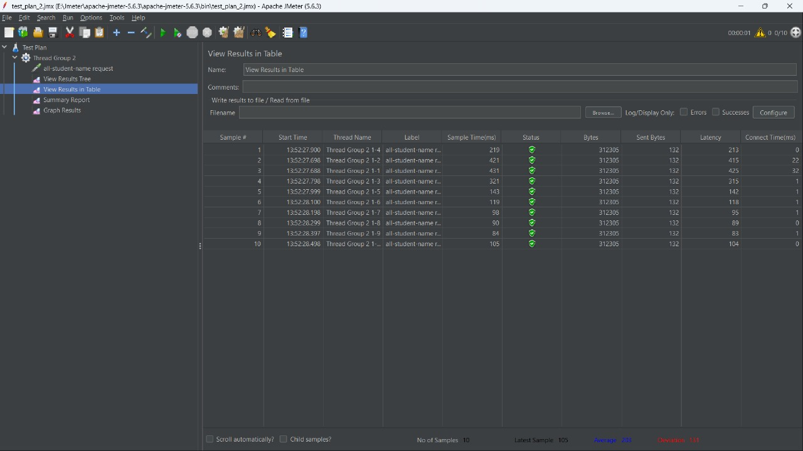

# Performance Testing and Profiling

## Before Optimization

/all-students before profiling.

/all-student-name before profiling.

/highest-gpa before profiling.

Using Command Line:

/all-students before profiling.

/all-student-name before profiling.

/highest-gpa before profiling.

## After Optimization

/all-students after profiling.

/all-student-name after profiling.

/highest-gpa after profiling.

Using Command Line:

/all-students after profiling.

/all-student-name after profiling.

/highest-gpa after profiling.

## Conclusion

Berdasarkan perbandingan hasil JMeter sebelum dan sesudah melakukan profiling, kita menemukan bahwa kecepatan eksekusi request dari kedua implementasi sangatlah berbeda. Hal ini terutama dapat dilihat pada implementasi function getAllStudentCourses (endpoint all-student), di mana sebelum melakukan profiling waktu yang dibutuhkan berkisar pada angka 72.000 ms, tetapi setelah dilakukan profiling angka ini turun secara signifikan ke kisaran 3.500-4.000 ms. Hal ini menunjukkan penurunan waktu eksekusi sebesar 94-95% yang tentunya akan sangat berpengaruh terhadap suatu aplikasi. Kemudian, hal yang sama juga terjadi pada dua function lainnya yaitu findStudentWithHighestGpa (highest-gpa) yang berubah dari rata-rata 220 ms menjadi 88 ms, menunjukkan penurunan waktu eksekusi sebesar 60%. Terakhir, terdapat fungsi joinStudentNames (endpoint all-student-name), di mana terjadi penurunan dari rata-rata 1688 ms menjadi 193 ms, menunjukkan penurunan sebesar 88%. Dengan demikian, kita dapat menyimpulkan bahwa proses optimasi dengan memanfaatkan profiling terbukti efektif dalam meningkatkan performa dari sistem secara keseluruhan tanpa mengubah fungsionalitas yang ada. 