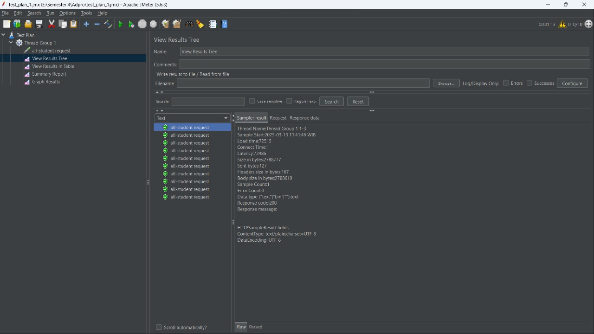
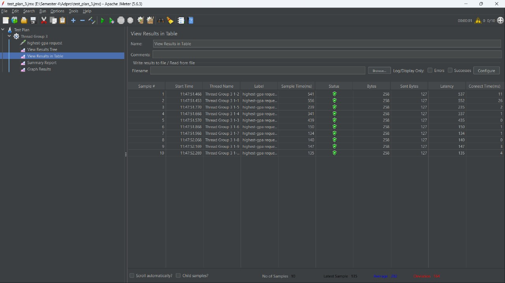
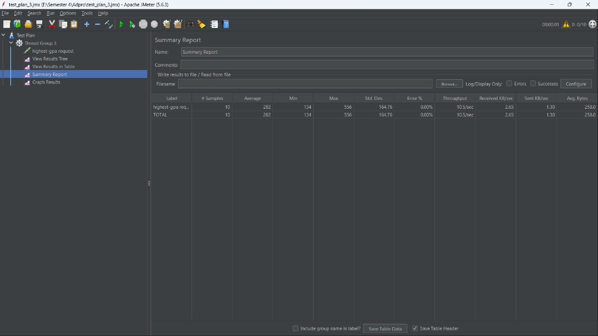
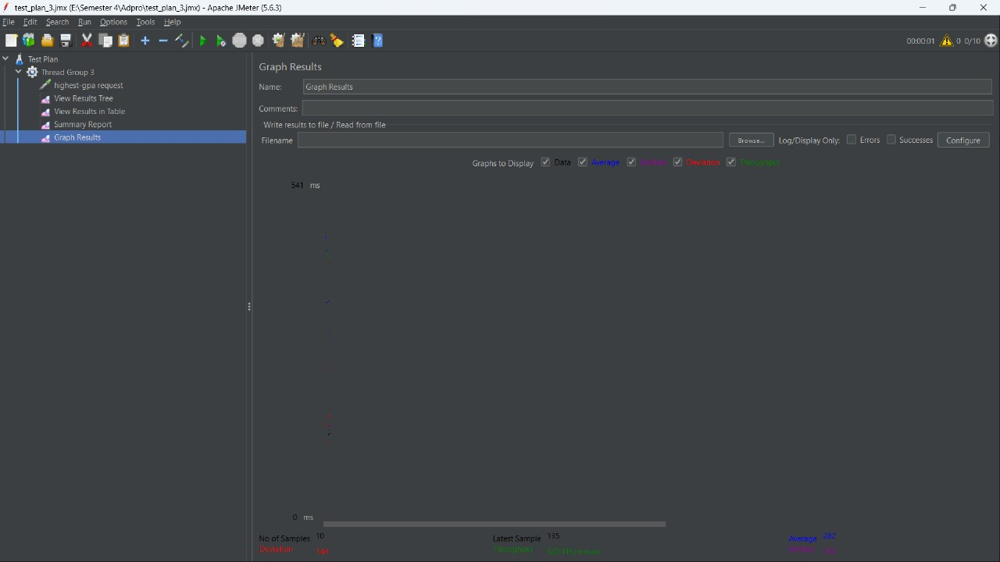
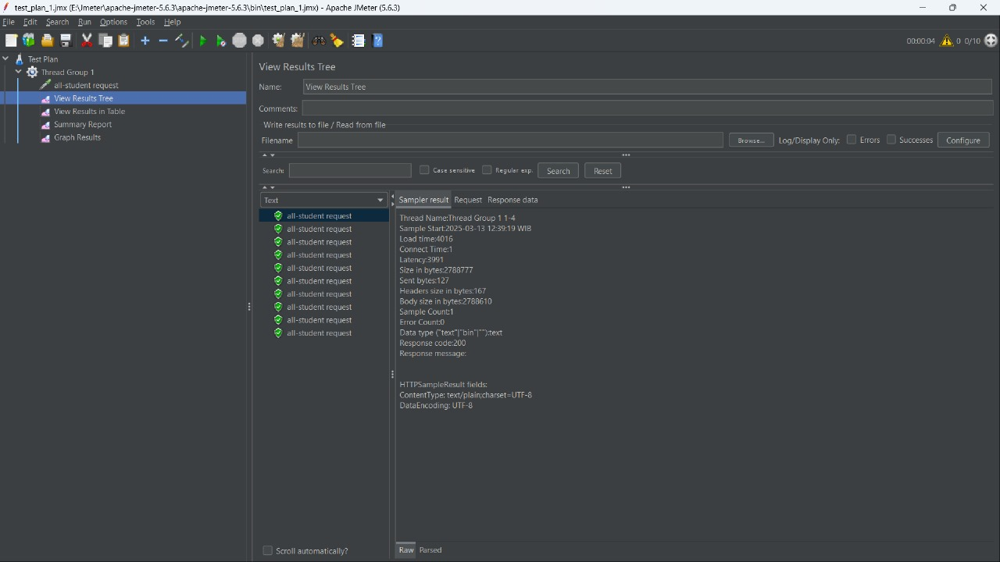

# Performance Testing and Profiling

## Before Optimization

/all-students before profiling.

/all-student-name before profiling.

/highest-gpa before profiling.

Using Command Line:

/all-students before profiling.

/all-student-name before profiling.

/highest-gpa before profiling.

## After Optimization

/all-students after profiling.

/all-student-name after profiling.

/highest-gpa after profiling.

Using Command Line:

/all-students after profiling.

/all-student-name after profiling.

/highest-gpa after profiling.

## Conclusion

Berdasarkan perbandingan hasil JMeter sebelum dan sesudah melakukan profiling, kita menemukan bahwa kecepatan eksekusi request dari kedua implementasi sangatlah berbeda. Hal ini terutama dapat dilihat pada implementasi function getAllStudentCourses (endpoint all-student), di mana sebelum melakukan optimasi dengan profiling waktu yang dibutuhkan berkisar pada angka 72.000 ms, tetapi setelah dilakukan optimasi angka ini turun secara signifikan ke kisaran 3.500-4.000 ms. Hal ini menunjukkan penurunan waktu eksekusi sebesar 94-95% yang tentunya akan sangat berpengaruh terhadap suatu aplikasi. Kemudian, hal yang sama juga terjadi pada dua function lainnya yaitu findStudentWithHighestGpa (highest-gpa) yang berubah dari rata-rata 220 ms menjadi 88 ms, menunjukkan penurunan waktu eksekusi sebesar 60%, dan fungsi joinStudentNames (endpoint all-student-name) yang berubah dari rata-rata 1688 ms menjadi 193 ms, menunjukkan penurunan sebesar 88%. Dengan demikian, kita dapat menyimpulkan bahwa proses optimasi dengan memanfaatkan profiling terbukti efektif dalam meningkatkan performa dari sistem secara keseluruhan tanpa mengubah fungsionalitas yang ada. 

# Reflection
> What is the difference between the approach of performance testing with JMeter and profiling with IntelliJ Profiler in the context of optimizing application performance?

Pendekatan pengujian performa dengan memanfaatkan JMeter dan profiling dengan Intellij Profiler memiliki fokus yang cukup berbeda dalam proses optimasi aplikasi. JMeter berfokus pada perspektif pengguna dengan mensimulasikan beban eksternal melalui banyak request bersamaan untuk menganalisis latensi dan kemampuan sistem merespons, tanpa memperhatikan cara kerja internal program. Sementara itu, Intellij Profiler berfokus pada perspektif pengembang dengan memberikan analisis mendalam tentang pemanfaatan sumber daya, waktu eksekusi per function atau method, dan bottleneck pada level kode, memungkinkan kita selaku pengembang mengidentifikasi secara tepat bagian mana yang perlu dioptimasi. Kedua pendekatan ini sendiri walau berbeda satu sama lain, tetapi juga saling melengkapi dalam proses optimasi suatu aplikasi.

> How does the profiling process help you in identifying and understanding the weak points in your application?

Profiling membantu saya dalam mengidentifikasi dan memahami weakness atau kelemahan dalam aplikasi dengan memberikan gambaran rinci tentang kinerja dan pemanfaatan sumber daya untuk setiap function, method, dan kelas. Proses ini merekam berbagai metrik penting seperti waktu eksekusi, alokasi memori, dan penggunaan CPU secara _real-time_, sehingga saya dapat melihat dengan jelas bagianmana yang menjadi bottleneck dalam aplikasi ini. Dengan informasi tersebut, saya dapat fokus dalam mengoptimasi kode "hanya" pada bagian yang menghambat kinerja secara keseluruhan. Pendekatan ini memungkinkan saya meningkatkan performa aplikasi secara signifikan tanpa perlu memperbaiki terlalu banyak kode.

> Do you think IntelliJ Profiler is effective in assisting you to analyze and identify bottlenecks in your application code?

Ya, menurut saya, Intellij Profiler sangat efektif dalam menganalisis ddan mengidentifikasi bottleneck dalam kode aplikasi karena tools ini mampu memberikan visualisasi yang jelas (seperti flame graph) tentang performa program. Tool ini memungkinkan kita selaku developer melihat secara detail metode mana yang mengkonsumsi waktu dan sumber daya yang paling banyak. Dengan informasi-informasi tersebut, kita dapat langsung mengarahkan upaya optimasi ke area atau bagian kode secara tepat. Selain itu, kapabilitas untuk membandingkan performa sebelum dan sesudah perubahan juga sangat membantu dalam memverifikasi efektivitas optimasi yang dilakukan.

> What are the main challenges you face when conducting performance testing and profiling, and how do you overcome these challenges?

Tantangan utama yang saya hadapi dalam melakukan performance testing dan profiling adalah sulitnya melakukan identifikasi bottleneck yang sebenarnya karena banyaknya data yang dihasilkan sehingga mengakibatkan kebingungan dalam memahami bagian program mana yang menjadi bottleneck. Hal ini dapat ditangani dengan cara mencoba untuk membaca dan menginterpretasikan hasil output, baik dari JMeter maupun Profiler, dengan lebih baik dan hati-hati, sehingga kesimpulan yang didapatkan dari hasil tersebut dapat secara optimal meningkatkan performa program.

> What are the main benefits you gain from using IntelliJ Profiler for profiling your application code?

Keunggulan utama Intellij Profiler terletak pada kemampuannya untuk mengidentifikasi bagian program yang menjadi titik bottleneck dengan menampilkan seluruh durasi eksekusi dari setiap method yang ada. Profiler memungkinkan kita selaku developer untuk melihat seberapa sering suatu method dipanggil, sehingga membantu dalam menentukan dengan tepat bagian kode mana yang memerlukan optimasi. Dengan visualisasi yang baik, kita dapat dengan mudah memahami kinerja aplikasi dan menemukan masalah performa yang terkadang sulit ditemukan dengan cara konvensional. Fitur perbandingan hasil profiling juga sangat membantu memastikan bahwa perbaikan yang kita lakukan benar-benar meningkatkan kinerja dari aplikasi secara keseluruhan.

> How do you handle situations where the results from profiling with IntelliJ Profiler are not entirely consistent with findings from performance testing using JMeter?

Ketika menghadapi perbedaan hasil antara Intellij Profiler dengan JMeter, terlebih dahulu kita perlu memahami bahwa kedua tool ini memiliki fokus pengukuran yang berbeda, di mana Intellij menekankan performa internal kode sementara JMeter mengukur respons sistem keseluruhan di bawah beban. Untuk mengatasi masalah ketidakkonsistenan ini, kita dapat melakukan pengujian secara terisolasi untuk mengkonfirmasi hasil dari setiap tool. Hal ini dapat dilakukan dengan memanfaatkan container seperti Docker untuk menciptakan lingkungan pengujian yang lebih konsisten. Jika analisis mendalam ini belum membuahkan hasil, kita dapat melakukan validasi tambahan dengan alat pihak ketiga untuk mengidentifikasi sumber masalah sebenarnya.

> What strategies do you implement in optimizing application code after analyzing results from performance testing and profiling? How do you ensure the changes you make do not affect the application's functionality?

Saya mengimplementasikan beberapa strategi optimasi kode setelah melakukan analisis hasil performance testing dan profiling dengan fokus pada identifikasi bottleneck menggunakan tools seperti JMeter. Setelah menemukan area yang bermasalah, saya menerapkan teknik optimasi seperti penggunaan Java Stream API untuk operasi data dan menghindari operasi String yang tidak efisien. Untuk memastikan kebenaran dari kode hasil refactoring, untuk saat ini saya melakukannya masih secara manual yaitu memastikan outputnya sama antara program sebelum dan sesudah optimasi. Namun, terdapat cara yang lebih baik lagi, yaitu dengan membangun unit test seperti yang telah dibahas pada beberapa tutorial sebelumnya, dengan demikian kita tidak perlu melakukan pengecekan kebeneran kode secara manual.